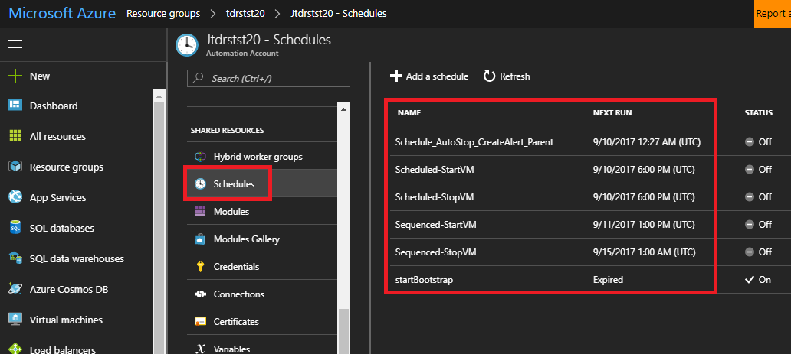
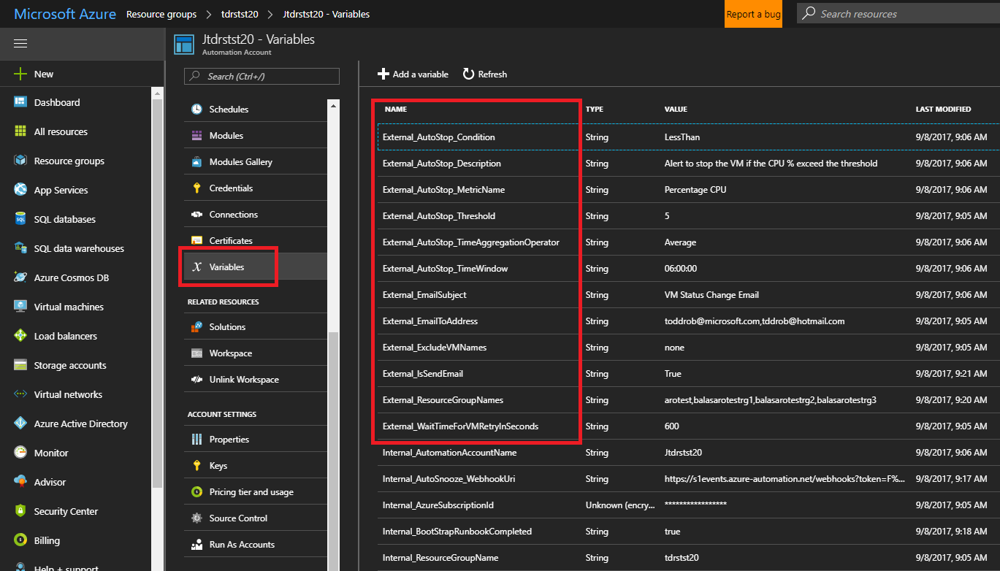
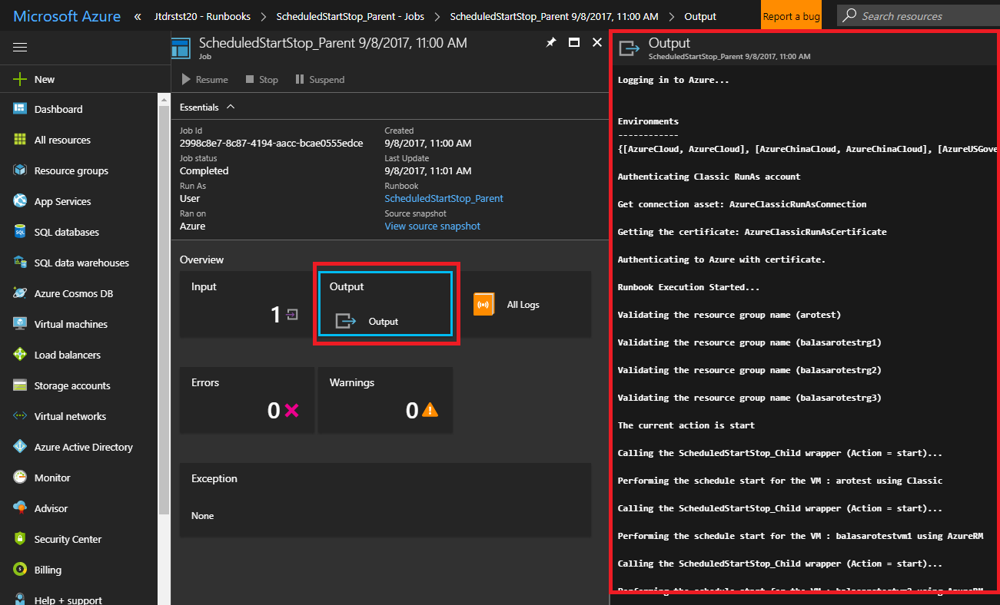
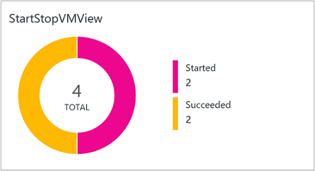
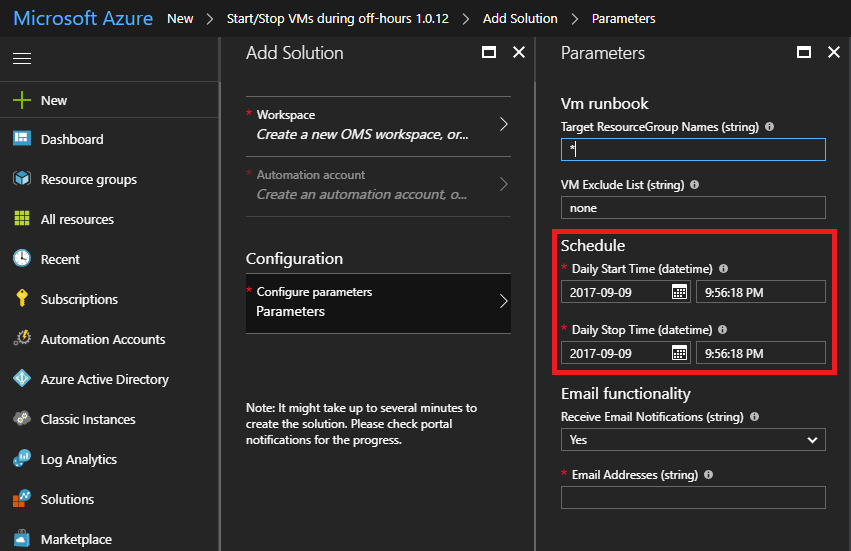
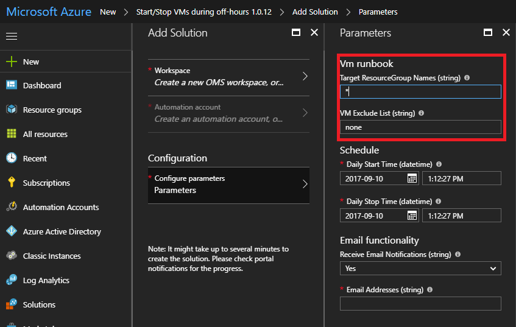
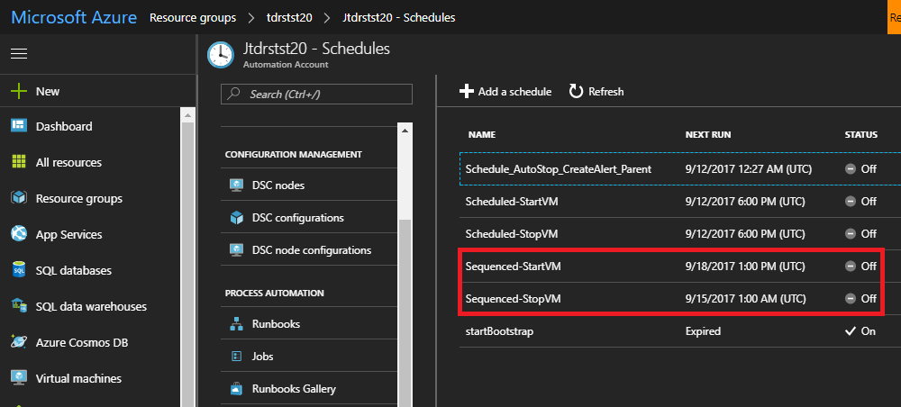
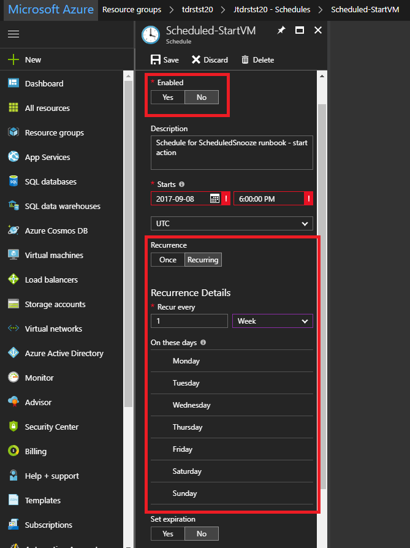

# **Start/Stop VMs during off-hours solution in Azure Automation**
The Stop/Start VMs during off-hours solution starts and stops your Azure Resource Manager virtual machines on user-defined schedules, provides insights through OMS Log Analytics, and sends optional emails by leveraging <a href="https://azuremarketplace.microsoft.com/en-us/marketplace/apps/SendGrid.SendGrid?tab=Overview" target="target">SendGrid</a>.  Supports both ARM and classic VMs for most scenarios.

***Objective:*** Provide decentralized automation capabilities for customers who want to reduce their costs.  Features include: 
1.  Schedule VMs to stop/start  
2.  Schedule VMs to stop/start in ascending and descending order using Azure Tags
3.  Auto stop VMs based on low CPU

***Prerequisites:*** 
* The runbooks work with an Azure Run As account. The Run As account is the preferred authentication method since it uses certificate authentication instead of a password that may expire or change frequently. 
* This solution can only manage VMs that are in the same subscription as where the Automation account resides. 
* This solution only deploys to the following Azure regions - Australia Southeast, East US, Southeast Asia, and West Europe. * The runbooks that manage the VM schedule can target VMs in any region. 
* To send email notifications when the start and stop VM runbooks complete, you must select select "Yes" to deploy SendGrid for email notifications during deployment from Azure Marketplace.

To use this solution, you only need to be familiar with four things:
1.  <a href="https://docs.microsoft.com/en-us/azure/automation/automation-schedules" target="target">Scheduling a runbook in Azure Automation</a> 

2.  <a href="https://docs.microsoft.com/en-us/azure/automation/automation-variables" target="target">Updating a variable in Azure Automation</a> 

3.  Starting a runbook and reading its output

4.  Viewing a chart in OMS

# **Overview**
The deployed Azure Automation account comes with preconfigured runbooks, schedules, and Log Analytics that allow you to tailor start/ stop of VMs to suit your business needs.  Let’s go over a few common scenarios to get started.

<h2>Scenario #1: Daily stop/start VMs across a subscription or target resource groups (Enabled by default)</h2>

For example, stop all the VMs across a subscription in the evening when you leave work and start them in the morning when you are back in the office.  
When you configure these two options during deployment: 

You are creating a daily Azure Automation Schedule (“Scheduled-StartVM” and “Scheduled-StopVM” that will start and stop targeted VMs.  You control which VMs are in scope by configuring these two variables: 

which are then stored as “External_ResourceGroupNames” and “External_ExcludeVMNames” in Azure Automation variables.  New VMs are automatically added to the start and stop schedules.

***Pro Tip:*** To customize which days of the week this take effect edit the schedule in the Azure automation account.  

***Pro Tip:*** Execute the “ScheduledStartStop_Parent” runbook with the action variable set to either “start” or “stop” and the whatif variable set to False.  This will allow you to preview that action that would take place if whatif was set to False.  We recommend running your scenario first with whatif set to True to ensure targeting of intended VMs

<h2>Scenario #2: Sequence the stop/start VMs across a subscription by using tags</h2>

For example, you’d like to stop the web servers first, stop a secondary SQL server, and the stop the primary SQL server in an deployed environment and then reverse the order for the start action.  You can accomplish this adding a “SequenceStart” tag and “SequenceStop” tag with a positive integer value to VMs across your subscription.  The start and stop actions will be performed in ascending order.  

Next, go into Schedules and find "Scheduled-StartVM" and "Scheduled-StopVM". 

Update the days and times to suit your needs and enable the schedule.

***Pro Tip:*** Execute the “SequencedStartStop_Parent” runbook with the action variable set to either “start” or “stop” and the whatif variable set to True to preview changes. 

***Note:*** As Azure Tags are not supported on Classic VMs, this solution does not support Classic VMs. 

<h2>Scenario #3: Auto stop/start VMs across a subscription based on CPU utilization</h2>

For example, you’d like to start up your VMs in the morning, and then in the evening stop the ones that aren’t being used.  

Enable one of the below based on your preference, but not both.  
* **Target stop action by subscription and resource group:**  Execute the “AutoStop_CreateAlert_Parent” runbook with the action variable set to “start” and the whatif variable set to True to preview changes.   If the correct VMs are being targeted, enable/update the "Schedule_AutoStop_CreateAlert_Parent" schedule.

* **Target stop action by VM list:**  Execute the “AutoStop_CreateAlert_Parent” runbook with the whatif variable set to True, add a comma separated list of VMs (VM1, VM2, VM3) in the “VMList” parameter.  For this scenario, you will need to create you own Automation schedule.  For details, see <a href="https://docs.microsoft.com/en-us/azure/automation/automation-schedules" target="target">scheduling a runbook in Azure Automation</a> 

Now that you have a schedule for stopping VMs based on CPU utilization, it's time to enable one of the below schedules to start them.  
* **Target start action by Subscription and Resource Group:**  See the steps in Scenario #1 for testing and enabling "Scheduled-StartVM" schedule.
* **Target start action by Tag:**  See the steps in Scenario #2 for testing and enabling "Sequenced-StartVM" schedule.

***Pro Tip:*** Execute the appropriate runbooks with whatif variable set to True to preview changes. 

# **All about each Default Schedule**
This is a list of each of the Default Schedules which will be deployed with Azure Automation.   Modify these default schedules or create your own custom schedules.  By default each of these schedules are disabled except for "Scheduled_StartVM" and "Scheduled-StopVM".

It is not recommended to enable ALL schedules as there would an overlap on which schedule performs an action, rather it would be best to determine which optimizations you wish to perform and choose accordingly.  See the above Overview section for some example scenarios. 

**ScheduleName** | **Time and Frequency** | **What it does**
--- | --- | ---
Schedule_AutoStop_CreateAlert_Parent | Time of Deployment, Every 8 Hours | Runs the AutoStop_CreateAlert_Parent runbook every 8 hours, which in turn will stop VM’s based on rules defined in the External_AutoStop* Asset Variables. 
Scheduled_StopVM | User Defined, Every Day | Runs the Scheduled_Parent runbook with a parameter of “Stop” every day at the given time.  Will Automatically stop all VM’s that meet the rules defined via Asset Variables.  Recommend enabling the sister schedule, Scheduled-StartVM.  
 Scheduled_StartVM | User Defined, Every Day | Runs the Scheduled_Parent runbook with a parameter of “Start” every day at the given time.  Will Automatically start all VM’s that meet the rules defined via Asset Variables.  Recommend enabling the sister schedule, Scheduled-StopVM.
 Sequenced-StopVM | 1:00AM (UTC), Every Friday | Runs the Sequenced_Parent runbook with a parameter of “Stop” every Friday at the given time.  Will sequentially (ascending) stop all VM’s with a tag of “Sequence” defined.  Refer to Runbooks section for more details on tag values.  Recommend enabling the sister schedule, Sequenced-StartVM.
 Sequenced-StartVM | 1:00PM (UTC), Every Monday | Runs the Sequenced_Parent runbook with a parameter of “Start” Every Monday at the given time.  Will  sequentially (descending) start all VM’s with a tag of “Sequence” defined.  Refer to Runbooks section for more details on tag values.  Recommend enabling the sister schedule, Sequenced-StopVM.

# **All about each Runbook**

This is a list of runbooks that will be deployed with Azure Automation.  It is not recommended that you make changes to the runbook code, but rather write your own runbook for new functionality.

***Pro Tip:*** Don’t directly run any runbook with the name “Child” appended to the end.

  **Runbook Name** | **Parameters** | **What it does**
  --- | --- | ---
  AutoStop\_CreateAlert\_Child | VMObject   AlertAction   WebHookURI | Called from the parent runbook only. Creates alerts on per resource basis for AutoStop scenario.
  AutoStop\_CreateAlert\_Parent | WhatIf: True or False.   VMList | Creates or updates azure alert rules on VMs in the targeted subscription or resource groups.   WhatIf: True -> Runbook output will tell you which resources will be targeted.   WhatIf: False -> Create or update the alert rules.   VMList -> Comma separated list of VMs.  For example, "vm1,vm2,vm3"
  AutoStop\_Disable | none | Disable AutoStop alerts and default schedule.
  AutoStop\_StopVM\_Child | WebHookData | Called from parent runbook only. Alert rules call this runbook and it does the work of stopping the VM.
  Bootstrap\_Main | none | Used one time to set-up bootstrap configurations such as webhookURI which is typically not accessible from ARM. This runbook will be removed automatically if deployment has gone successfully.
   ScheduledStartStop\_Child | VMName:   Action: Stop or Start   ResourceGroupName: | Called from parent runbook only. Does the actual execution of stop or start for scheduled Stop.
  ScheduledStartStop\_Parent | Action: Stop or Start   WhatIF: True or False | This will take effect on all VMs in the subscription unless you edit the “External\_ResourceGroupNames” which will restrict it to only execute on these target resource groups. You can also exclude specific VMs by updating the “External\_ExcludeVMNames” variable. WhatIf behaves the same as in other runbooks.
  SequencedStartStop\_Parent | Action: Stop or Start   WhatIf:  True or False | Create a tag called “SequenceStart” and another tag called "SequenceStop" on each VM that you want to sequence start\\stop activity for. The value of the tag should be an positive integer (1,2,3) that corresponds to the order you want to start\\stop in ascending order. WhatIf behaves the same as in other runbooks.   **Note: This will work exclusively off tag values and will run subscription wide.**

# **All about each Variable**

This is a list of variables that will be deployed with Azure Automation.  

***Pro Tip:*** Only change variables prefixed with "External".  Do not change variables prefixed with "Internal"

  **Variable Name** | **Description** 
  --- | --- 
  External\_AutoStop\_Condition | This is the conditional operator required for configuring the condition before triggering an alert. Possible values are [GreaterThan, GreaterThanOrEqual, LessThan, LessThanOrEqual].
  External\_AutoStop\_Description | Alert to stop the VM if the CPU % exceed the threshold.
  External\_AutoStop\_MetricName | Name of the metric the Azure Alert rule is to be configured for.
  External\_AutoStop\_Threshold | Threshold for the Azure Alert rule. Possible percentage values ranging from 1 to 100.
  External\_AutoStop\_TimeAggregationOperator | The time aggregation operator which will be applied to the selected window size to evaluate the condition. Possible values are [Average, Minimum, Maximum, Total, Last].
  External\_AutoStop\_TimeWindow | The window size over which Azure will analyze selected metric for triggering an alert. This parameter accepts input in timespan format. Possible values are from 5 mins to 6 hours.
  External\_EmailSubject | Email subject text (title).
  External\_EmailToAddress | Enter the recipient of the email.  Seperate names by using comma(,).
  External\_ExcludeVMNames | Excluded VMs as comma separated list: vm1,vm2,vm3
  External\_IsSendEmail | Option to send email (Yes) or not send email (No). This option should be 'No' if you did not create SendGrid during the initial deployment.
  External\_ResourceGroupNames | Resource groups (as comma separated) targeted for Snooze actions: rg1,rg2,rg3
  Internal\_AutomationAccountName | Azure Automation Account Name.
  Internal\_AutoSnooze_WebhookUri | Webhook URI called for the AutoStop scenario.
  Internal\_AzureSubscriptionId | Azure Subscription Id.
  Internal\_ResourceGroupName | Azure Automation Account resource group name.
  Internal\_SendGridAccountName | SendGrid Account Name.
  Internal\_SendGridPassword | SendGrid Password.

# **Configuring e-mail notifications**
 You must select “Yes” to “Receive Email Nonfictions” parameter during the initial deployment for e-mail notification or you will need to re-deploy the Start/Stop VMs during off-hours solution again from Azure marketplace.  
 
Two Azure automation variables control email:
1.	External_EmailToAddress -> comma separated list of emails (user@hotmail.com, user@outlook.com)
2.	External_IsSendEmail -> Yes to receive emails, No to not receive emails
